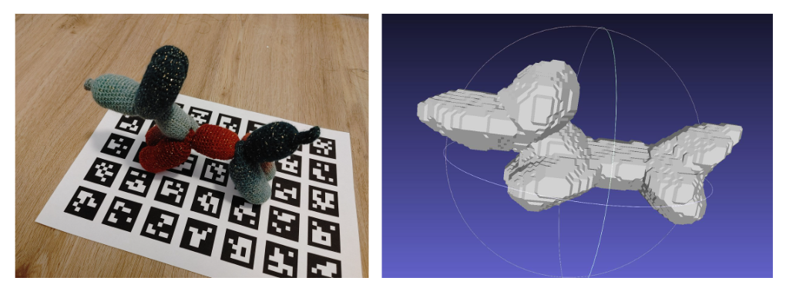

# AR Markers \+ Voxel Carving
This is the AR Marker + Voxel Carving project for the 3D Scanning &amp; Motion Captures lecture.
The Github repo can be found here: https://github.com/ayjchen/3dsmc-ar-voxel-carving. 


## Required Dependencies
- Eigen
- OpenCV
- yaml-cpp


## Setup

### Part 1: Foreground Segmentation (Preprocessing)
Using meta's Segment Anything Model 2 (SAM2), masks were created for each raw input image file.
The Github repo can be found here: https://github.com/facebookresearch/sam2.git

*Note*: This step does not need to be conducted explicitly again for the demonstration project, as the masks are pre-saved and can be found at the `data_no_aruco/` directory.

### Part 2: Voxel Carving
There are two corresponding executable and linking libraries to `CameraCalibration` and `VoxelCarving` respectively. `CameraCalibration` generates the calibration file with the camera intrinsics that is required to run the voxel carving process.

Each of the processes can be toggled within `CMakeLists.txt`. 

#### Calibrating the camera intrinsics
Running `./CameraCalibration` will generate the corresponding camera intrinsics from the image data stored at the directory `../data_raw/`. The output reprojection error, camera matrix, and distortion coefficients will be stored as a `.yml` output file.  

#### Generating the output mesh
After obtaining the camera calibration file, the voxel carving executable can be run as follows:

```
./VoxelCarving <image_directory> <masked_image_directory> <calibration_results.yml> <output.off>
```

For the demonstration project:
```
./VoxelCarving ../data_preprocessed/bdog_v3/ ../data_no_aruco/bdog_v3/ ./bdog_v3_calibration_results.yml output.off
```

The main function reads in the input files, input masks, and camera intrinsics. The full ARUco marker sheet is then parsed and used as reference to generate a mapping of each marker's corresponding coordinates in the reconstruction space. The inputs are then passed through the pipeline of voxel carving, which involves AR marker detection, pose estimation, carving, postprocessing, and rendering.


## Example Reconstruction Results
Below is the result from the example done for the project:
